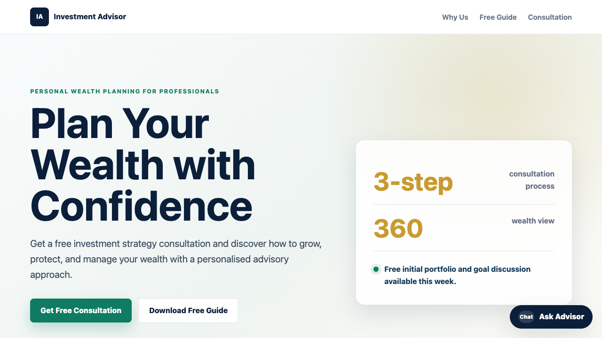

<div align="center">

# n8n Investment Advisor

[](https://developer.mozilla.org/en-US/docs/Web/HTML)
[](https://developer.mozilla.org/en-US/docs/Web/CSS)
[](https://developer.mozilla.org/en-US/docs/Web/JavaScript)
[](https://n8n.io/)
[](#license)

**A responsive one-page investment advisor lead magnet website connected to an n8n enquiry and chatbot workflow.**

[Report Bug](https://github.com/alfredang/n8n-investmentadvisor/issues) | [Request Feature](https://github.com/alfredang/n8n-investmentadvisor/issues)

</div>

## Screenshot



## About

This project is a modern static website for an investment advisor lead magnet. It collects enquiry form leads, runs a floating chatbot widget, and sends both visitor enquiries and chatbot messages to a shared n8n webhook.

The chatbot collects the visitor's name, phone number, and email before answering general investment questions, so an advisor can follow up when needed. The n8n workflow includes compliance-focused system instructions and FAQ-style guidance for the AI agent.

## Features

| Area | Details |
| --- | --- |
| Lead magnet page | Hero, trust indicators, guide offer, benefits, enquiry form, and footer |
| Enquiry form | Sends `GET` query parameters to the n8n webhook without reloading the page |
| Chatbot | Floating widget with contact-first intake, chat history, loading state, and reply rendering |
| n8n workflow | Separate GET enquiry and POST chatbot webhook paths on the same webhook URL |
| AI guidance | FAQ-style answers with compliance rules against guaranteed returns, stock tips, and personalised advice |
| Responsive design | Mobile-friendly static HTML, CSS, and JavaScript only |

## Tech Stack

| Category | Technology |
| --- | --- |
| Frontend | HTML5, CSS3, vanilla JavaScript |
| Automation | n8n webhook workflow |
| AI workflow | n8n AI Agent with OpenAI Chat Model |
| Notifications | Gmail node in n8n for advisor email alerts |
| Hosting | Any static host, GitHub Pages, Netlify, Vercel, or a simple web server |

## Architecture

```text
Visitor Browser
  |
  |-- GET enquiry form query params
  |-- POST chatbot JSON body
  v
n8n Webhook
  |
  |-- Enquiry path
  |     |-- Format lead details
  |     |-- Email advisor
  |     `-- Return success JSON
  |
  `-- Chat path
        |-- Normalize message and contact details
        |-- Apply FAQ and compliance system prompt
        |-- Call AI model
        `-- Return { reply }
```

## Project Structure

```text
n8n-investmentadvisor/
|-- index.html
|-- style.css
|-- script.js
|-- investment-chatbot-enquiry.json
|-- screenshot.png
`-- README.md
```

## Getting Started

Clone the repository:

```bash
git clone https://github.com/alfredang/n8n-investmentadvisor.git
cd n8n-investmentadvisor
```

Run a local static server:

```bash
python3 -m http.server 4173
```

Open:

```text
http://127.0.0.1:4173/
```

## n8n Setup

Import `investment-chatbot-enquiry.json` into n8n.

Check these nodes after import:

- `Enquiry Webhook` receives `GET` form submissions.
- `Chat Webhook` receives `POST` chatbot messages.
- `OpenAI Chat Model` has a valid OpenAI credential.
- `Email Advisor` has a valid Gmail credential, or remove/disable it if email notification is not needed.
- The workflow is active.

The website is configured to use:

```text
https://n8n.srv923061.hstgr.cloud/webhook/12663502-ff47-45b6-9a8f-c67c083603d9
```

## Webhook Payloads

Enquiry form submission uses `GET` query parameters:

```text
?type=enquiry&name=Jane&email=jane@example.com&phone=98765432&goal=Retirement&message=Hello
```

Chatbot submission uses `POST` JSON:

```json
{
  "type": "chat",
  "message": "What is diversification?",
  "name": "Jane Lee",
  "phone": "98765432",
  "email": "jane@example.com",
  "source": "investment-advisor-website"
}
```

Expected chatbot response:

```json
{
  "reply": "AI response here"
}
```

## Deployment

This is a static site, so it can be deployed on any static hosting platform.

For GitHub Pages:

1. Push this repository to GitHub.
2. Open repository settings.
3. Enable Pages from the `main` branch.
4. Use the published Pages URL as the public website.

## Compliance Note

The website and chatbot provide general information only. The chatbot is instructed not to promise guaranteed returns, recommend specific stocks or products, provide exact buy/sell instructions, or give personalised financial advice. Visitors should speak with a licensed advisor before making investment decisions.

## Developed By

Powered by [Tertiary Infotech Academy Pte Ltd.](https://www.tertiaryinfotech.com/)

## License

This project is provided for educational and demonstration purposes. Add a license file if you plan to distribute or reuse it publicly.
